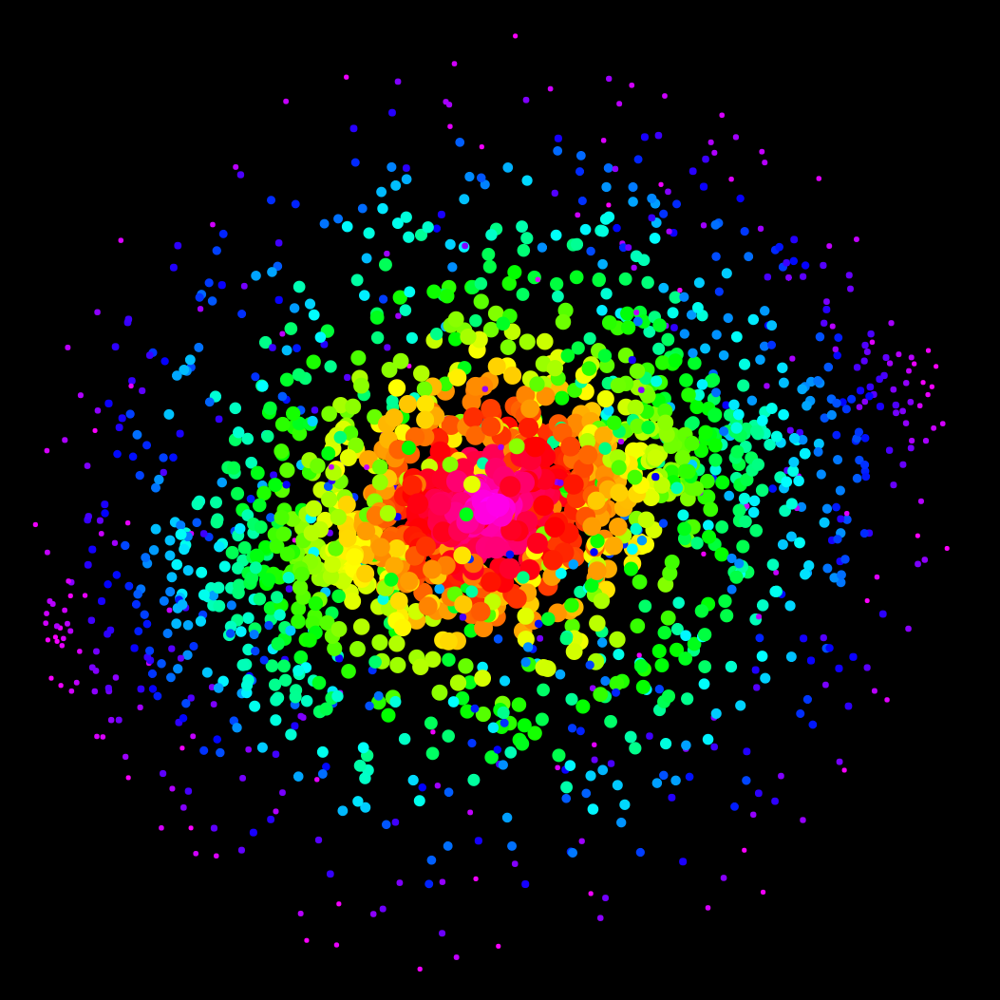

# rainbow-star-cluster

> random distribution of colored dots in 3D

## preview
- [preview.html](./preview.html)
- https://codepen.io/dym-sh/pen/abmovpP/left/?editors=0010

## mirrors
- https://github.com/dym-sh/rainbow-star-cluster
- https://gitlab.com/dym-sh/rainbow-star-cluster
- https://dym.sh/rainbow-star-cluster
- hyper://6a276e7ca4f18c383136fb068e2cb14d1b62e81cc9dbf0b5c5322d6e7ad49d35 /[?](https://beakerbrowser.com)

## license
[mit](./license)
